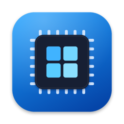
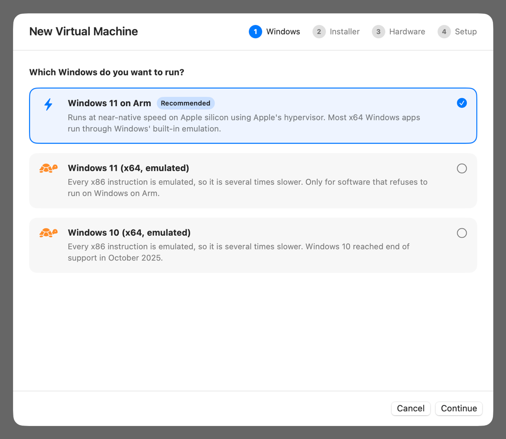
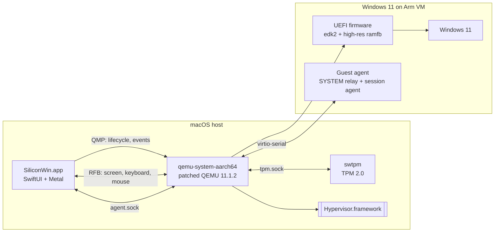

<div align="center">



# SiliconWin: Windows 11 on Apple Silicon Macs

**Run Windows 11 on your M1, M2, M3, M4 or M5 Mac at near-native speed. Free, open source and fully automatic.**

SiliconWin is a native macOS app that downloads, installs and runs Windows 11 on Arm in a virtual machine.<br>
It uses Apple's Hypervisor framework with its own builds of QEMU, the UEFI firmware and a TPM 2.0 emulator.<br>
It's a free, open-source alternative to Parallels Desktop, VMware Fusion and UTM for running Windows on a Mac.

[](https://github.com/devdasx/SiliconWin/actions/workflows/ci.yml)
[](LICENSE)
[](#requirements)
[](#requirements)
[](App/Package.swift)
[](Scripts/build-qemu.sh)

[Features](#features) ·
[Getting started](#getting-started) ·
[Install guide](docs/INSTALL.md) ·
[User guide](docs/USAGE.md) ·
[Architecture](docs/ARCHITECTURE.md) ·
[Building](docs/BUILDING.md) ·
[FAQ](#faq)



</div>

## Why SiliconWin?

Running Windows on an Apple silicon Mac usually means a commercial virtualization product or a lot of manual QEMU work. SiliconWin is a small, open-source, native app that handles everything:

- It fetches the **official Windows 11 on Arm ISO** from Microsoft inside the app.
- It writes an answer file, adds the drivers and creates your account.
- It boots the installer and presses the "boot from CD" key for you.
- It hands you a signed-in Windows desktop. You click nothing in Windows Setup.

Everything the virtual machine needs ships inside the app bundle. That includes a patched QEMU, custom UEFI firmware, a software TPM and the VirtIO drivers. There are no kernel extensions and no admin rights, and nothing is installed outside the app.

## Features

| | |
| --- | --- |
| ⚡️ **Near-native speed** | Windows 11 on Arm runs directly on your Mac's CPU through Apple's `Hypervisor.framework` (`-accel hvf`, host CPU model). Windows' built-in Prism emulation runs most x64 apps. |
| 🪄 **Zero-touch install** | An `autounattend.xml` answer file handles the whole install. It skips the hardware checks and partitions the disk. It installs Windows 11 Pro with Microsoft's generic installation key and creates a local account. It skips every out-of-box question and signs in automatically. |
| 🔐 **TPM 2.0** | Windows sees a real TPM 2.0, provided by `swtpm`, so TPM-based features such as BitLocker are available. The TPM state lives with the VM. |
| 🖥️ **Sharp, fluid display** | Custom edk2 firmware adds high-resolution modes, including your exact full-screen size at 2× Retina. A patched QEMU refreshes at 60 fps, and SiliconWin draws each frame with Metal. |
| ⌨️ **Mac-friendly keyboard** | ⌘C, ⌘V and other shortcuts become Ctrl shortcuts. ⌘ on its own opens Start, and ⌃⌥⌦ sends Ctrl+Alt+Delete. SiliconWin sends physical key positions, so every Windows keyboard layout works, and it copies your Mac's keyboard layouts and time zone into Windows. |
| 📋 **Clipboard and file drop** | Text syncs both ways. Text that password managers mark as concealed never leaves the Mac. Drag files or folders onto the Windows screen and they land in **Desktop › From Mac**. |
| 🕰️ **Instant snapshots** | Snapshots of the Windows disk, UEFI variables and TPM state are APFS clones. They take a second to create and only use space for what changes later. |
| 💾 **Sparse disks** | A 1 TB virtual disk only uses the space Windows actually writes. TRIM inside Windows returns freed space to your Mac. |
| 🌐 **Network and sound** | NAT networking (VirtIO) without root, and Intel HD Audio through CoreAudio. |
| 🧩 **Self-contained** | QEMU, the firmware, swtpm, the dylibs and the drivers all ship inside `SiliconWin.app`. A VM is one `.winvm` folder that you can move, back up or delete. |
| 🧪 **x64 Windows (experimental)** | Windows 10 and Windows 11 x64 run through full x86 emulation (QEMU TCG). It works, but it is several times slower. |

## Requirements

- **A Mac with Apple silicon** (M1 or later). Windows on Arm needs hardware virtualization.
- **macOS 14 Sonoma or later.** It is developed and tested on macOS 27 with an Apple M4 Max.
- **Memory:** 16 GB or more recommended. A VM uses 4–8 GB by default.
- **Storage:** about 30 GB for an up-to-date Windows 11 install, plus about 8 GB for the ISO. An external SSD works well, because SiliconWin keeps its library next to the app on external drives.
- **Building from source:** Xcode 16 or later (Swift 6), Homebrew, and about 5 GB for the build area. See [docs/BUILDING.md](docs/BUILDING.md).
- **A Windows license** if you want to activate Windows. SiliconWin installs Windows unactivated.

## Getting started

SiliconWin is distributed as source code. The first build compiles QEMU, the UEFI firmware and the TPM from source. After that, rebuilding the app takes seconds.

> [!TIP]
> **New to building Mac apps?** Follow the **[step-by-step installation guide](docs/INSTALL.md)**. It covers checking your Mac, installing Xcode and Homebrew, building, and installing Windows, with screenshots of what to expect.

```bash
# 1. Build dependencies
brew install glib pixman libpng zstd llvm lld openssl@3 gnutls libtasn1 \
             autoconf automake libtool pkgconf

# 2. Clone and build
git clone https://github.com/devdasx/SiliconWin.git
cd SiliconWin
Scripts/build-app.sh          # → dist/SiliconWin.app

# 3. Run
open dist/SiliconWin.app
```

Then, in the app:

1. Click **New Virtual Machine** and choose **Windows 11 on Arm**.
2. Click **Download from Microsoft…**. Microsoft's official download page opens inside SiliconWin. Choose your language and download the Arm64 ISO. You can also choose an ISO you already have.
3. Pick the processor cores, memory, disk size and display resolution.
4. Keep **Install Windows automatically** on. Enter a user name and accept the Microsoft Software License Terms.
5. Click **Create and Install**. Windows installs by itself and restarts a few times. You reach the desktop after about 15–30 minutes.

The [user guide](docs/USAGE.md) covers everything else: snapshots, file transfer, display settings, keyboard shortcuts and more.

## Keyboard and integration

| On the Mac | In Windows |
| --- | --- |
| ⌘C ⌘V ⌘X ⌘Z ⌘A ⌘S ⌘F … | Ctrl+C, Ctrl+V, … (turn off **Mac keyboard shortcuts** in Settings to use ⌘ as the Windows key) |
| ⌘ pressed alone | Start menu (Windows key) |
| ⌃⌥⌦, or the **Ctrl+Alt+Delete** toolbar button | Ctrl+Alt+Delete |
| ⌃⌘F, or the **Full Screen** toolbar button | Full screen, pixel-exact when the VM uses a full-screen resolution |
| Copy text on either side | Shared clipboard (optional, see [Security](#security)) |
| Drag files onto the Windows screen, or click **Send Files** | Copied to **Desktop › From Mac** (folders arrive as `.zip`) |

## How it works



- **The app** is written in SwiftUI. It starts one QEMU process per VM and controls it through **QMP**, QEMU's JSON protocol, over a Unix socket. It shows the screen with its own **RFB (VNC) client**: the client writes pixels into a Metal texture in shared memory, and keyboard and mouse events go back the same way.
- **The VM** is QEMU's `virt` machine with GICv3, HVF and the host CPU. It has an NVMe disk, a USB keyboard and tablet, a ramfb display, VirtIO network, RNG and serial devices, Intel HD Audio, and a TPM 2.0 (TIS) served by swtpm.
- **The guest agent** is a pair of PowerShell scripts. A SYSTEM relay owns the VirtIO serial port and forwards it to a named pipe. A per-user agent connects to that pipe and handles the clipboard and incoming files.

[docs/ARCHITECTURE.md](docs/ARCHITECTURE.md) covers the internals: the launch plan, the display pipeline, keyboard translation, the agent protocol, the unattended install flow and snapshots.

### Custom-built components

| Component | What SiliconWin changes |
| --- | --- |
| **QEMU 11.1.2** | Built with HVF, VNC, slirp, CoreAudio and PNG support. [`0001-ui-60fps-display-refresh.patch`](Scripts/patches/qemu/0001-ui-60fps-display-refresh.patch) raises display refresh from about 30 to 60 fps. [`0002-hvf-skip-unaligned-sections.patch`](Scripts/patches/qemu/0002-hvf-skip-unaligned-sections.patch) fixes an `HV_BAD_ARGUMENT` crash that happens when a TPM is attached under HVF on Macs with 16 KB pages. |
| **edk2 UEFI firmware** | [`QemuRamfb.c`](Firmware/src/QemuRamfb.c) offers 18 display modes up to 3840×2160, plus any exact size up to 5120×2880 that the app passes through `fw_cfg`. The stock firmware stops at 1024×768, and Windows on Arm keeps the mode the firmware sets. Built with LLVM (`CLANGDWARF`), with PEIM shadowing enabled so the TPM stack works. |
| **swtpm 0.10.2 + libtpms 0.10.2** | The software TPM 2.0 that Windows 11 expects. |
| **libslirp 4.9.5** | User-mode networking, so the VM gets internet access without root. |
| **VirtIO drivers 0.1.302** | Red Hat's ARM64 and x64 Windows drivers for network, RNG, serial and balloon devices, as distributed by Fedora. Windows Setup installs them through `$WinPEDriver$`. |

## Project layout

```text
SiliconWin/
├── App/                     Swift package for SiliconWin.app
│   ├── Sources/SiliconWin/
│   │   ├── App/             app entry point, menus, quit handling
│   │   ├── Model/           GuestOS, VMConfiguration, VMLibrary
│   │   ├── Engine/          VirtualMachine, QEMU launch plan, QMP, sockets, snapshots
│   │   ├── Display/         RFB client, Metal display view, keyboard translation
│   │   ├── Setup/           answer file, tools disc, locale mapping, ISO download
│   │   └── UI/              SwiftUI views
│   └── Resources/           Info.plist, entitlements, Windows guest tools
├── Firmware/                patched edk2 ramfb driver and firmware build config
├── Scripts/                 build scripts, QEMU patches, runtime bundler, icon
└── docs/                    install guide, user guide, architecture, building, troubleshooting
```

## Documentation

| Document | Contents |
| --- | --- |
| [Installation guide](docs/INSTALL.md) | Step by step from a fresh Mac to a running Windows desktop |
| [User guide](docs/USAGE.md) | Creating VMs, the install, display, keyboard, clipboard, files, snapshots, settings |
| [Architecture](docs/ARCHITECTURE.md) | How the app, QEMU, firmware, TPM and guest tools fit together |
| [Building](docs/BUILDING.md) | Prerequisites, build scripts, configuration, signing, CI |
| [Troubleshooting](docs/TROUBLESHOOTING.md) | Common problems, log files, recovery |
| [Changelog](CHANGELOG.md) | Release history |
| [Contributing](CONTRIBUTING.md) | How to report issues and send pull requests |

## Limitations

SiliconWin is a young project. Be aware of these limitations:

- **No 3D acceleration.** Windows uses the Microsoft Basic Display Adapter on a framebuffer. Everyday desktop apps work well. Games and GPU-heavy apps don't.
- **Fixed resolution while running.** To change the resolution, choose a new one in the VM's settings and restart Windows.
- **One-way file transfer.** Files go from the Mac to Windows. Shared folders aren't implemented yet.
- **Text-only clipboard.** Images and files don't go through the clipboard.
- **No USB passthrough.**
- **x64 Windows is emulated.** It is slow, and less tested than Windows on Arm.
- **Unsigned builds.** You build and ad-hoc sign the app yourself. There is no notarized download.

Contributions that improve any of these are very welcome. See [CONTRIBUTING.md](CONTRIBUTING.md).

## FAQ

<details>
<summary><b>Do I need a Windows license?</b></summary>

You can install and use Windows without a product key, but it stays unactivated: Windows shows a watermark and some personalization settings are locked. To activate, enter your own key in **Settings › System › Activation**. Microsoft's license terms apply to Windows. SiliconWin asks you to accept them before an automatic install, because the answer file accepts them on your behalf.
</details>

<details>
<summary><b>Is this supported by Microsoft?</b></summary>

No. Microsoft names a few authorized virtualization solutions for running Windows 11 on Apple silicon Macs, and SiliconWin is not one of them. It is an independent open-source project, not affiliated with Microsoft or Apple.
</details>

<details>
<summary><b>Why QEMU instead of Apple's Virtualization framework?</b></summary>

Virtualization.framework is built for macOS and Linux guests. It has no TPM, no display device that Windows on Arm has a driver for, and no way to load custom firmware. QEMU with the HVF accelerator gets the same hardware virtualization from `Hypervisor.framework` and gives full control over the virtual hardware Windows needs.
</details>

<details>
<summary><b>Can I run x64 Windows apps?</b></summary>

Yes. Windows 11 on Arm includes Prism, which runs most x86 and x64 apps. Software with x64 kernel drivers, such as some anti-cheat systems, VPN clients and hardware tools, won't run. For those, the x64 guests are an experimental, slow option.
</details>

<details>
<summary><b>Where are my virtual machines?</b></summary>

If the app runs from an external drive, the library is a `SiliconWin Library` folder on that drive. Otherwise it is in `~/Library/Application Support/SiliconWin`. You can change the location in **SiliconWin › Settings**. Each VM is one `.winvm` folder with its disk, UEFI variables, TPM state, snapshots and logs.
</details>

<details>
<summary><b>How do I uninstall SiliconWin?</b></summary>

1. Shut down your VMs and quit the app.
2. Delete `SiliconWin.app` and the library folder.
3. Optionally, run `defaults delete app.siliconwin.SiliconWin` to remove the settings.
4. Optionally, delete the build area (`~/SiliconWin-build` by default).
</details>

## Security

Windows runs isolated in a virtual machine, but a few features cross that boundary on purpose:

- **Clipboard sharing.** Text you copy on the Mac becomes readable by software in Windows, and Windows can replace your Mac's clipboard. Concealed and transient items, which password managers use for secrets, are never sent. Turn sharing off in **Settings › Integration** while you handle sensitive data.
- **Account password.** The password for an automatic install is stored in plain text in the VM's folder: `config.json` and the tools disc. Use a password you don't use elsewhere, or none.

To report a vulnerability, follow [SECURITY.md](SECURITY.md). Please don't open a public issue for it.

## Contributing

Bug reports, ideas and pull requests are welcome. Please read [CONTRIBUTING.md](CONTRIBUTING.md) and follow the [Code of Conduct](CODE_OF_CONDUCT.md).

## License

SiliconWin's own code is released under the [MIT License](LICENSE).

The project also contains files derived from other projects, which keep their original licenses:

- The firmware driver in `Firmware/` is derived from edk2 and is under BSD-2-Clause-Patent.
- The QEMU patches in `Scripts/patches/qemu/` are under GPL-2.0-or-later.

A built `SiliconWin.app` bundles QEMU, swtpm, libtpms, edk2 firmware, GLib and other components under their own licenses. Those include the GPL and LGPL, so if you redistribute a build, you must comply with them. See [THIRD_PARTY_NOTICES.md](THIRD_PARTY_NOTICES.md).

## Acknowledgements

SiliconWin stands on the shoulders of these projects:

- [QEMU](https://www.qemu.org)
- [TianoCore edk2](https://github.com/tianocore/edk2)
- [swtpm](https://github.com/stefanberger/swtpm) and [libtpms](https://github.com/stefanberger/libtpms)
- [libslirp](https://gitlab.freedesktop.org/slirp/libslirp)
- [ACPICA](https://github.com/acpica/acpica)
- [virtio-win](https://github.com/virtio-win/kvm-guest-drivers-windows)
- [GLib](https://gitlab.gnome.org/GNOME/glib)

Thank you to everyone who maintains them.

---

<sub>Microsoft, Windows and Windows 11 are trademarks of the Microsoft group of companies. Apple, Mac, macOS and Apple silicon are trademarks of Apple Inc., registered in the U.S. and other countries. Parallels and VMware Fusion are trademarks of their respective owners. SiliconWin is an independent project and is not affiliated with, sponsored by or endorsed by Microsoft, Apple or any other company named here.</sub>
