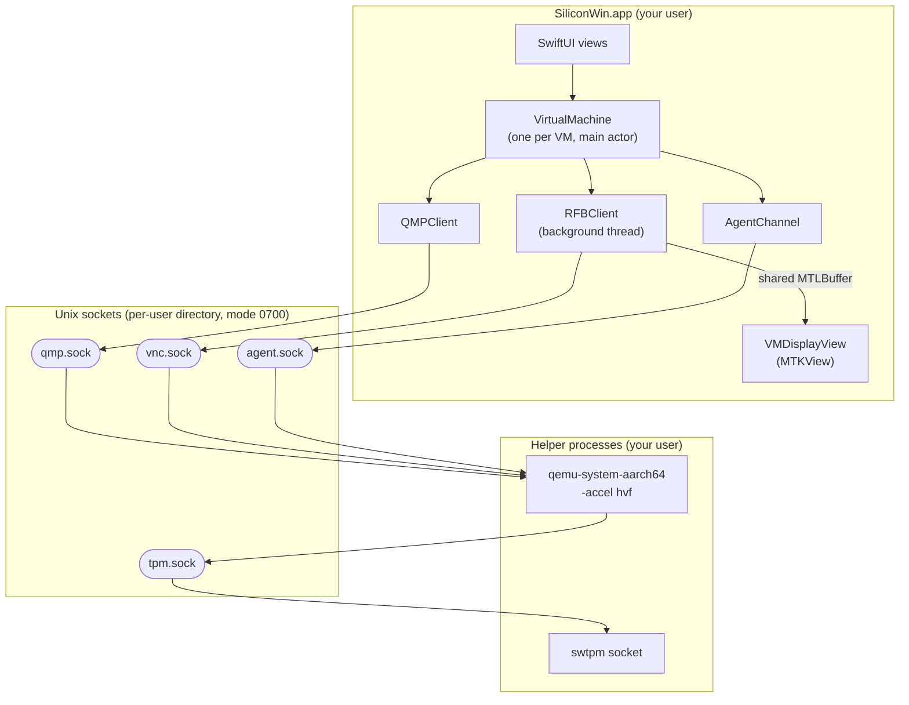
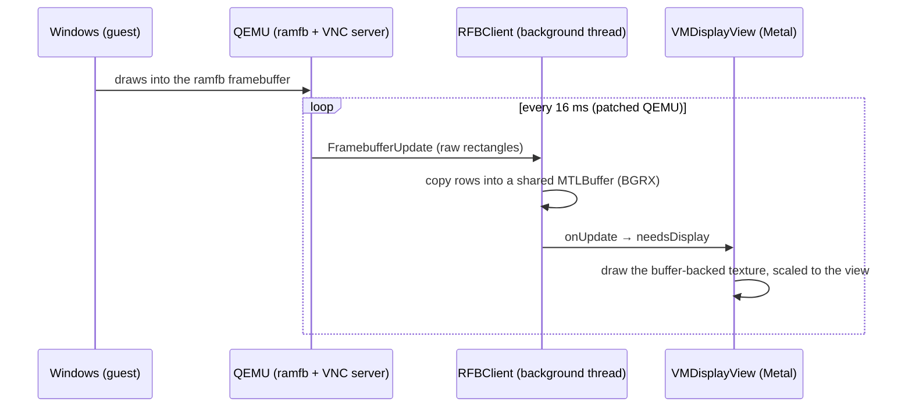
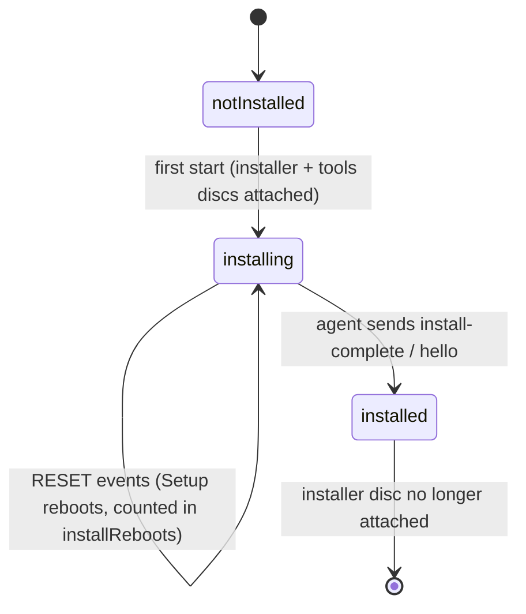

# Architecture

This document explains how SiliconWin works internally: the processes it runs, how the app talks to them, the virtual hardware, the display and input pipeline, the unattended installation, the guest agent and storage.

- [Overview](#overview)
- [Source map](#source-map)
- [The VM bundle](#the-vm-bundle)
- [Starting a VM](#starting-a-vm)
- [Virtual hardware](#virtual-hardware)
- [Display pipeline](#display-pipeline)
- [Keyboard and mouse](#keyboard-and-mouse)
- [Firmware](#firmware)
- [TPM 2.0](#tpm-20)
- [Unattended installation](#unattended-installation)
- [Guest agent](#guest-agent)
- [Storage and snapshots](#storage-and-snapshots)
- [Packaging and signing](#packaging-and-signing)

## Overview



SiliconWin runs **one QEMU process per running VM**, plus one **swtpm** process when the TPM is enabled. The app never embeds QEMU. It talks to it over four Unix sockets in a private per-user directory:

| Socket | Protocol | Used for |
| --- | --- | --- |
| `qmp.sock` | [QMP](https://www.qemu.org/docs/master/interop/qmp-spec.html) (JSON) | Lifecycle (`stop`, `cont`, `system_reset`, `system_powerdown`, `quit`), events (`STOP`, `RESUME`, `RESET`, `SHUTDOWN`, `POWERDOWN`), `send-key`, `query-blockstats` |
| `vnc.sock` | RFB 3.8 with QEMU extensions | Framebuffer updates, keyboard and pointer input |
| `agent.sock` | Line-based text protocol | The guest agent in Windows, through a VirtIO serial port |
| `tpm.sock` | swtpm control channel | QEMU's TPM emulator backend |

There are no TCP ports. The VM reaches the network through QEMU's user-mode NAT (libslirp).

## Source map

| File | Responsibility |
| --- | --- |
| `App/SiliconWinApp.swift` | App entry point, menus (**Virtual Machine** menu), clean shutdown of running VMs on quit |
| `Model/GuestOS.swift` | The supported Windows editions, their architecture, download pages and ISO name matching |
| `Model/VMConfiguration.swift` | Per-VM settings (`config.json`), display resolutions, answers for unattended setup |
| `Model/VMLibrary.swift` | Library location, VM discovery (off the main thread), creating and trashing VMs |
| `Engine/VirtualMachine.swift` | VM state machine, process management, QMP events, installer handling, the agent, clipboard, file transfer, thumbnails |
| `Engine/QEMULaunchPlan.swift` | Builds the QEMU command line and the socket paths |
| `Engine/QMPClient.swift` | QMP client, plus `AgentChannel` for the guest agent socket |
| `Engine/UnixSocket.swift` | Blocking Unix socket wrapper, buffered reader and line reader |
| `Engine/BundledRuntime.swift` | Finds QEMU, swtpm, firmware, drivers and guest tools inside the app bundle |
| `Engine/Snapshots.swift` | APFS clone-based snapshots |
| `Display/RFBClient.swift` | RFB client that writes pixels straight into a Metal-shared buffer |
| `Display/VMDisplayView.swift` | `MTKView` subclass: rendering, mouse, scroll wheel, keyboard, drag-and-drop |
| `Display/KeyboardMap.swift` | macOS key codes to PC scancodes, Mac shortcut translation, synthetic-event handling |
| `Setup/UnattendXML.swift` | Generates `autounattend.xml` |
| `Setup/GuestToolsMedia.swift` | Builds the per-VM `SILICONWIN` tools disc |
| `Setup/WindowsLocale.swift` | Maps the Mac's time zone and keyboard layouts to Windows identifiers |
| `Setup/DownloadCenter.swift` | Streams ISO downloads from Microsoft's website to the library |
| `UI/*` | SwiftUI views: library, VM screen, new-VM wizard, settings, snapshots, Microsoft download sheet |

## The VM bundle

Each VM is a folder named `<name>.winvm` in the library's `Virtual Machines` folder:

```text
Windows 11.winvm/
├── config.json             VMConfiguration (JSON, tolerant decoding for forward/backward compatibility)
├── disk.img                Windows' C: drive, a sparse raw image
├── efi-vars.fd             UEFI variable store (boot entries, Secure Boot keys, settings)
├── TPM/                    swtpm state (the TPM's persistent memory)
├── Snapshots/<uuid>/       one folder per snapshot: snapshot.json + clones of the files above
├── siliconwin-tools.iso    SILICONWIN disc: answer file, drivers, guest tools
├── screenshot.png          latest picture of the screen for the library (640 px wide)
└── Logs/
    ├── qemu.log            QEMU command line + output (previous run: qemu-previous.log)
    └── swtpm.log
```

## Starting a VM

`VirtualMachine.start()` runs these steps. Any failure tears everything down and shows the error.

1. **Check the runtime.** The app verifies that the bundled QEMU binary, firmware and drivers for the guest's architecture are present.
2. **Prepare media.** The app rebuilds the tools disc when Windows isn't installed yet, so it always matches the current settings, or when the app's guest tools are newer than the disc. If the UEFI variable store is missing, the app copies a fresh one from the template.
3. **Create sockets.** The app creates `/tmp/siliconwin-<uid>/<first 8 hex digits of the VM id>/` with mode `0700` and removes stale sockets. Unix socket paths are limited to 104 bytes, so the sockets can't live inside the VM bundle.
4. **Start the TPM.** The app starts `swtpm socket --tpm2` with its state in `TPM/` and waits for `tpm.sock`.
5. **Start QEMU.** The app launches QEMU with the [launch plan](#virtual-hardware). Output goes to `Logs/qemu.log`.
6. **Connect.**
   - QMP: negotiate capabilities and start receiving events.
   - RFB: hand the framebuffer to the display view.
   - Agent: connect to `agent.sock`. The agent says `hello` once Windows has started.
7. **Run.** If this is the first boot of an installation, the app [answers the boot prompt](#unattended-installation). It then starts a clipboard sync timer (0.5 s) and a thumbnail timer (60 s).

**Stopping:**

| Action | How it works |
| --- | --- |
| **Shut Down** | Sends `system_powerdown`, which is an ACPI power-button press. Windows shuts down by itself, and the app captures a thumbnail first. |
| **Turn Off** | Sends QMP `quit`, then `SIGTERM` after 3 s, then `SIGKILL` after another 3 s. |
| **Quit with running VMs** | The app asks whether to shut the VMs down or turn them off, and quits once all QEMU processes have exited. |

## Virtual hardware

### Windows on Arm (`qemu-system-aarch64`)

| Device | QEMU options | Notes |
| --- | --- | --- |
| Machine | `-machine virt,highmem=on,gic-version=3 -accel hvf -cpu host` | Hardware virtualization through `Hypervisor.framework` |
| Firmware | two `pflash` drives: `siliconwin-aarch64-code.fd` (read-only) + `efi-vars.fd` | See [Firmware](#firmware) |
| Resolution | `-fw_cfg name=opt/siliconwin/resolution,string=WxH` | Read by SiliconWin's firmware |
| Display | `-device ramfb` | A simple framebuffer. Windows on Arm drives it through the firmware's GOP. |
| USB | `qemu-xhci` with `usb-kbd` and `usb-tablet` | The tablet gives absolute pointer positions, so the mouse is never captured |
| Disk | `nvme` on a raw `disk.img` with `discard=unmap,detect-zeroes=unmap,cache=writeback` | Windows has a built-in NVMe driver |
| Installer and tools discs | `usb-storage` with `media=cdrom` | Windows on Arm boots from USB CD drives |
| Network | `virtio-net-pci` on `-netdev user` (slirp NAT) | Locally administered MAC in `52:54:00:xx:xx:xx` |
| TPM | `tpm-tis-device` on `-tpmdev emulator` | Backed by swtpm |
| Other | `virtio-rng-pci`, `virtio-serial-pci` with port `org.siliconwin.agent.0`, `intel-hda` + `hda-output` on CoreAudio | Entropy, guest agent, sound |
| Misc | `-nodefaults -display none -vnc unix:… -qmp unix:… -rtc base=localtime` | No default devices, headless QEMU |

### Windows x64 (`qemu-system-x86_64`, experimental)

`q35` with TCG (`-accel tcg,thread=multi,tb-size=1024 -cpu max`), SeaBIOS, standard VGA (`vgamem_mb=64`, so Windows can change resolution itself), an NVMe disk, IDE CD drives and `e1000e` networking. The TPM is currently only enabled for UEFI (Arm) guests.

## Display pipeline



- **Pixels.** The client connects as a *shared* RFB 3.8 client without authentication. It asks for 32-bit BGRX pixels and these encodings: Raw, DesktopSize, ExtendedDesktopSize, QEMU Extended Key Event, LED state and QEMU Pointer Motion Change. Raw is the fastest choice over a local socket, because no compression work is needed.
- **Zero-copy texture.** The framebuffer is an `MTLBuffer` in shared storage, wrapped by a linear `MTLTexture`. The RFB thread writes rows directly into it, and the view draws the texture with no intermediate copy. When the guest changes resolution, the client allocates a new buffer and the view picks it up.
- **60 fps.** By default QEMU refreshes graphical consoles every 30 ms, and its VNC server backs off to every 3 s when the screen is idle. [`0001-ui-60fps-display-refresh.patch`](../Scripts/patches/qemu/0001-ui-60fps-display-refresh.patch) refreshes every 16 ms and limits idle back-off to 100 ms.
- **Full screen.** The default resolution is the main display's full-screen area in points (below the notch). In full screen, every Windows pixel maps to exactly 2×2 Retina pixels. The **Retina** option uses the physical pixel count instead; Windows should then be set to 200 % scaling.

## Keyboard and mouse

### Keyboard

- **Physical keys.** macOS virtual key codes are translated to PC XT scancodes, with extended keys flagged by bit `0x80` as an E0 prefix. They are sent with QEMU's Extended Key Event, so QEMU never has to interpret a keymap. Because positions rather than characters are sent, the Windows keyboard layout decides which character a key produces, whatever input source the Mac uses.
- **Mac shortcuts.** When **Mac keyboard shortcuts** is on, ⌘ plus a common shortcut key (A B C F I K L N O P R S T U V W X Y Z, 0, - and =) is sent as Ctrl plus that key. ⌘ with any other key acts as the Windows key. Pressing and releasing ⌘ on its own sends the Windows key. With the setting off, ⌘ is always the Windows key.
- **Synthetic input.** Automation tools and text expanders post events with a non-zero source PID. They often use key code 0 for every character and never send key-ups. Such events are typed as characters using the US layout, and shortcuts carried as flags (for example Ctrl+A) get their modifiers pressed around the key. Hardware key presses always take the physical-key path.
- **Pacing.** QEMU's USB keyboard queue holds 16 events. If it overflows, keys get dropped or stuck, which starts runaway auto-repeat in Windows. To prevent that, key events are queued and sent at most every 10 ms.
- **Ctrl+Alt+Delete.** Pressing ⌃⌥⌦ (⌃⌥fn⌫ on a laptop keyboard) sends it like any other key combination. The toolbar button and the **Virtual Machine** menu item send it through QMP `send-key`.

### Mouse

The `usb-tablet` device reports absolute coordinates. View coordinates are converted to framebuffer coordinates and sent as RFB pointer events. Scrolling becomes wheel buttons 4 and 5, and left, middle and right buttons map directly.

## Firmware

Windows on Arm has no driver for QEMU's `ramfb` device. It keeps using the framebuffer mode that the UEFI firmware set up through the Graphics Output Protocol (GOP). The stock edk2 `QemuRamfbDxe` only offers 640×480, 800×600 and 1024×768, which looks blurry on a Retina display.

SiliconWin builds its own **ArmVirtQemu** firmware from the edk2 tree that ships with QEMU 11.1.2. [`Firmware/src/QemuRamfb.c`](../Firmware/src/QemuRamfb.c) changes three things:

- It offers **18 modes**, from 640×480 up to 3840×2160.
- It reads `opt/siliconwin/resolution` (`"<width>x<height>"`, up to 5120×2880) from `fw_cfg`. If that size isn't one of the 18 modes, it adds it as a 19th.
- It sets `PcdVideoHorizontalResolution` and `PcdVideoVerticalResolution` to that size. The graphics console and the OS loader then keep it instead of falling back to a default.

[`Firmware/siliconwin-edk2.config`](../Firmware/siliconwin-edk2.config) matches the feature set of QEMU's own `armvirt.aa64` build: network boot, TLS, TPM 1.2/2.0 and the NX workarounds. It adds `PcdShadowPeimOnBoot = TRUE`. With the TPM enabled, some PEI modules write to global variables. ArmVirtQemu normally runs PEI modules in place from read-only flash, where those writes fault (a "Synchronous Exception" in `Tcg2Pei`). Shadowing the modules into RAM fixes that.

The firmware is compiled with Homebrew LLVM through edk2's `CLANGDWARF` toolchain. See [BUILDING.md](BUILDING.md#scriptsbuild-firmwaresh).

## TPM 2.0

Windows 11 expects TPM 2.0. SiliconWin builds **libtpms** and **swtpm** and starts one `swtpm socket --tpm2` per VM, with its state in the VM's `TPM/` folder. QEMU connects through `-tpmdev emulator` and exposes a `tpm-tis-device` (Arm) or `tpm-tis` (x64). Windows then shows a TPM 2.0 device (`ACPI\MSFT0101`), and the TPM's contents, including BitLocker keys, persist with the VM.

Attaching a TPM under HVF used to crash QEMU with `HV_BAD_ARGUMENT`. The TPM's 1 KiB Physical Presence Interface region isn't aligned to Apple silicon's 16 KiB pages, so it was never mapped as RAM, but QEMU still tried to *unmap* it. [`0002-hvf-skip-unaligned-sections.patch`](../Scripts/patches/qemu/0002-hvf-skip-unaligned-sections.patch) skips such sections in both directions.

## Unattended installation

### The SILICONWIN disc

For each VM, `GuestToolsMedia` builds `siliconwin-tools.iso` with `hdiutil makehybrid` (ISO 9660 + Joliet, volume label `SILICONWIN`):

```text
SILICONWIN/
├── autounattend.xml        Windows Setup answer file (generated by UnattendXML.swift)
├── $WinPEDriver$/          VirtIO drivers for the guest architecture (Setup installs them automatically)
└── SiliconWin/             guest tools: SetupComplete.cmd, install.cmd, agent.ps1, agent-host.ps1,
                            register-agent.ps1, README.txt
```

`autounattend.xml` contains:

- **windowsPE**
  - Language and keyboard settings.
  - For Windows 11, the `LabConfig` registry values that bypass the TPM, Secure Boot, RAM, storage and CPU checks.
  - A GPT layout: EFI, MSR and Windows partitions on disk 0.
  - The **Pro** edition, chosen with Microsoft's generic installation key. The key doesn't activate Windows.
  - `AcceptEula`. The wizard only enables automatic setup after you accept the license terms.
- **specialize**
  - Computer name and time zone.
  - A command that copies `SiliconWin\SetupComplete.cmd` from the disc to `%WINDIR%\Setup\Scripts`. Windows runs that file as SYSTEM at the end of Setup.
  - `BypassNRO`, which allows a local account without a network.
- **oobeSystem**
  - Every out-of-box screen is hidden, and the express (recommended) settings are declined (`ProtectYourPC` = 3).
  - A local account in the **Administrators** group is created.
  - Automatic sign-in is enabled.

### Boot and install flow



1. **First boot.** The firmware shows *"Press any key to boot from CD or DVD…"* for a few seconds. SiliconWin presses Enter every 0.7 s through QMP. To keep those presses from reaching Windows Setup, it watches `query-blockstats` for the installer drive. Once Windows Boot Manager has read more than 48 MB from the disc, `boot.wim` is loading and the key presses stop.
2. **Setup.** Windows Setup finds `autounattend.xml` and the drivers on the SILICONWIN disc and installs without any questions. Each reboot shows up as a QMP `RESET` event. After the first one, the app no longer presses keys, so the firmware boots from the disk instead of the installer.
3. **SetupComplete.** At the end of Setup, Windows runs `SetupComplete.cmd` as SYSTEM. It finds `SiliconWin\install.cmd` on the disc and runs it. `install.cmd` does five things:
   - copies the guest tools to `C:\Program Files\SiliconWin`,
   - installs any remaining VirtIO drivers with `pnputil`,
   - turns off sleep and hibernation,
   - writes `install-complete` to the VirtIO serial port, and
   - registers the guest agent.
4. **Done.** On `install-complete` (or the agent's first `hello`), the VM is marked as installed, and the installer disc isn't attached on later starts.

## Guest agent

### Why two processes?

Windows only lets SYSTEM and elevated administrators open the VirtIO serial port (`\\.\Global\org.siliconwin.agent.0`). The clipboard, however, belongs to the signed-in user's session. The agent is therefore split in two:

| Part | Runs as | Started by | Job |
| --- | --- | --- | --- |
| `agent-host.ps1` (host relay) | SYSTEM | Scheduled task **SiliconWin Host**, at startup, restarted if it fails | Owns the serial port and relays it to the named pipe `\\.\pipe\SiliconWinAgent`, which Authenticated Users may open |
| `agent.ps1` (session agent) | The signed-in user, not elevated | `HKLM\…\Run` key, through `conhost --headless` | Connects to the pipe. Syncs the clipboard and saves incoming files to **Desktop › From Mac**. |

Both scripts embed small C# helpers through `Add-Type` for the pipe and port I/O. Logs go to `C:\ProgramData\SiliconWin\host.log` and `%LOCALAPPDATA%\SiliconWin\agent.log`.

### Protocol

Each message is one line: `<command>[ <argument>…]`. Text and binary payloads are Base64-encoded, so a payload can never contain a line break.

| Message | Direction | Meaning |
| --- | --- | --- |
| `hello <version> <computer name>` | Windows → Mac | The session agent is running. The Mac marks the VM as installed and pushes its current clipboard if sharing is on. |
| `install-complete` | Windows → Mac | Windows Setup finished (sent by `install.cmd`). |
| `clipboard <base64 UTF-8>` | Both | The clipboard text changed on the sending side. |
| `file-begin <base64 name> <size>` | Mac → Windows | Start of a file transfer |
| `file-data <base64 chunk>` | Mac → Windows | Up to 48 KiB of file content |
| `file-end` | Mac → Windows | End of the file. The agent saves it in **Desktop › From Mac**. |
| `file-done <base64 name>` / `file-error <base64 message>` | Windows → Mac | Result of the transfer, shown in the app |

**Clipboard.** The Mac side polls `NSPasteboard.changeCount` every 0.5 s. It sends plain text up to 4 MB and never sends items marked `org.nspasteboard.ConcealedType` or `org.nspasteboard.TransientType`, which password managers use for secrets. It also remembers the last text received from Windows, so a change never echoes back and forth.

**Files.** Folders are zipped with `ditto -c -k --keepParent` first. Data is streamed in 48 KiB chunks, and progress shows in the toolbar.

### Updates

The app rebuilds the SILICONWIN disc whenever its bundled guest tools are newer than the disc. At startup, both scripts look for a copy with a higher `$AgentVersion` / `$HostVersion` and run it instead. They only consider the SILICONWIN disc that the app attached: a CD-ROM device whose PnP ID contains `QEMU` and whose volume label is `SILICONWIN`. A disc image or drive that a user mounts inside Windows can never supply code that runs as SYSTEM.

## Storage and snapshots

- **Sparse disks.** `disk.img` is created with `ftruncate`, so it takes no space until Windows writes to it. With `discard=unmap` and `detect-zeroes=unmap`, TRIM inside Windows punches holes in the file again. The **Use all free space** option sizes the virtual disk to the drive's free space, and actual usage grows only as needed.
- **Snapshots** need an APFS volume. When the VM is shut down, a snapshot `clonefile()`s `disk.img`, `efi-vars.fd` and the `TPM/` folder into `Snapshots/<uuid>/`, along with a small `snapshot.json`. Clones share blocks with the original, so a snapshot is instant and initially costs no space. Restoring clones the files back. The installation state is saved with the snapshot.
- **Library location.** When the app runs from an external volume (`/Volumes/<name>/…`), the default library is `/Volumes/<name>/SiliconWin Library`. Otherwise it is `~/Library/Application Support/SiliconWin`. A location chosen in Settings overrides both. Scanning happens off the main thread, so a slow drive or a pending macOS privacy prompt never blocks the UI.

## Packaging and signing

`Scripts/build-app.sh` assembles the bundle:

```text
SiliconWin.app/Contents/
├── MacOS/        SiliconWin, qemu-system-aarch64, qemu-system-x86_64, qemu-img, swtpm
├── Frameworks/   every non-system dylib QEMU and swtpm need (GLib, pixman, libslirp, libtpms, …)
└── Resources/
    ├── qemu/     siliconwin-aarch64-code.fd, edk2-arm-vars.fd, SeaBIOS, option ROMs, keymaps
    ├── Drivers/  arm64/ and amd64/ VirtIO drivers
    ├── GuestTools/
    └── AppIcon.icns
```

`Scripts/bundle-runtime.py` copies the binaries and walks their dylib dependencies recursively with `otool -L`. It copies every library outside `/usr/lib` and `/System` into `Frameworks/`, rewrites install names to `@executable_path/../Frameworks/…` and `@loader_path/…`, removes absolute rpaths, and strips debug symbols. The result runs on any Apple silicon Mac, without Homebrew.

**Signing** is ad hoc:

- The QEMU binaries get the `com.apple.security.hypervisor` entitlement, which is required to use `Hypervisor.framework`.
- The app is signed with an explicit designated requirement, `designated => identifier "app.siliconwin.SiliconWin"`. Ad-hoc signatures are otherwise identified by their code hash, which changes with every build. That would make macOS forget privacy approvals, such as access to a removable volume, after each rebuild.
