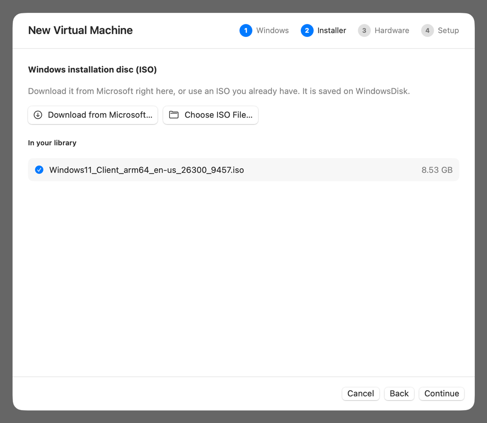
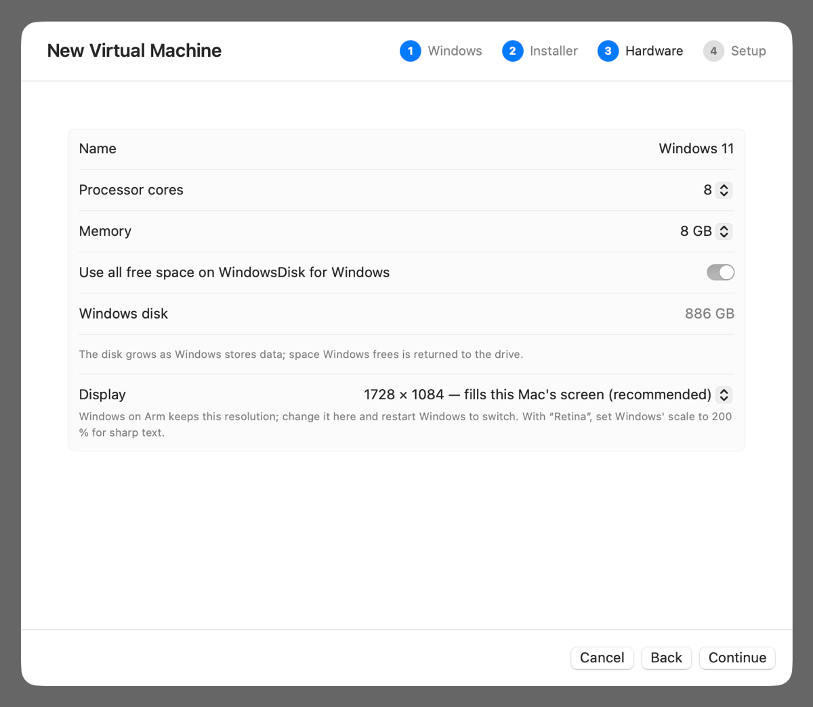
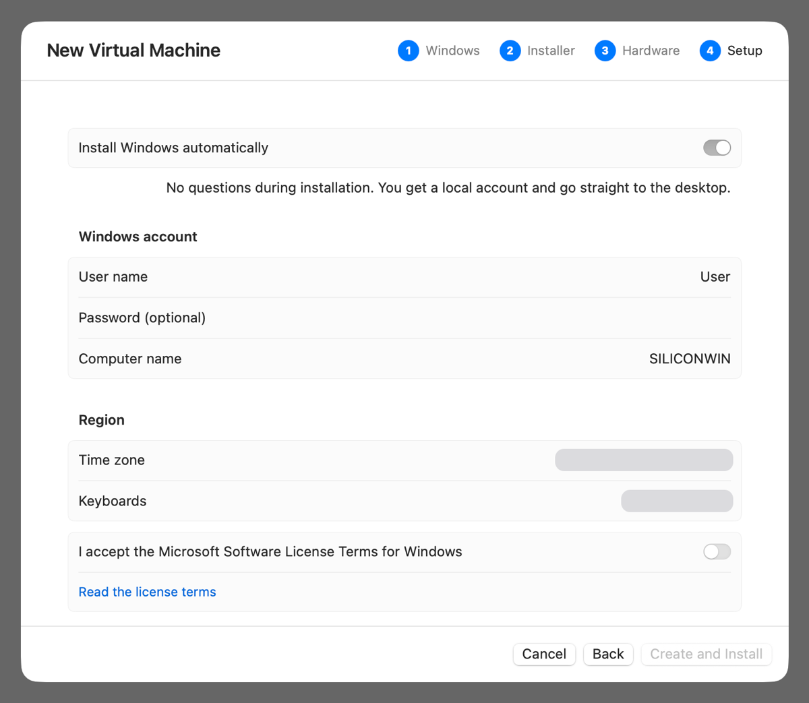

# Installation guide

This guide takes you from a fresh Mac to a running Windows 11 desktop, one step at a time. Plan for about an hour. Most of that time is spent waiting for the build to compile and Windows to install.

- [Step 1: Check your Mac](#step-1-check-your-mac)
- [Step 2: Install Xcode](#step-2-install-xcode)
- [Step 3: Install Homebrew and the build tools](#step-3-install-homebrew-and-the-build-tools)
- [Step 4: Download SiliconWin](#step-4-download-siliconwin)
- [Step 5: Build the app](#step-5-build-the-app)
- [Step 6: Open SiliconWin](#step-6-open-siliconwin)
- [Step 7: Create your Windows virtual machine](#step-7-create-your-windows-virtual-machine)
- [Step 8: Let Windows install](#step-8-let-windows-install)
- [Step 9: After installation](#step-9-after-installation)
- [Updating SiliconWin](#updating-siliconwin)
- [Uninstalling](#uninstalling)

## Step 1: Check your Mac

SiliconWin needs a Mac with **Apple silicon**: an M1, M2, M3, M4 or newer chip.

1. Open the Apple menu  › **About This Mac**.
2. Check that **Chip** shows *Apple M…*. If it shows *Intel*, SiliconWin won't work on this Mac.
3. Check that **macOS** is version **14 (Sonoma) or later**.

Or check in Terminal:

```bash
uname -m        # must print: arm64
sw_vers         # ProductVersion must be 14.0 or later
```

Also make sure you have:

| What | How much |
| --- | --- |
| Free disk space | About **45 GB**: 5 GB for the build, 8 GB for the Windows ISO and about 30 GB for Windows itself. An external SSD works well (see [tips](#tips-for-external-drives)). |
| Memory | 8 GB minimum, **16 GB or more** recommended. Windows gets 4–8 GB by default. |
| Internet | For the build tools, the source code and Windows itself |

## Step 2: Install Xcode

SiliconWin is written in Swift and needs Apple's compiler.

1. Install **Xcode** from the [Mac App Store](https://apps.apple.com/app/xcode/id497799835). It's free and large, so the download takes a while.
2. Open Xcode once. Accept the license and let it install its components, then quit Xcode.
3. In Terminal, make sure the command-line tools point to Xcode:

   ```bash
   sudo xcode-select --switch /Applications/Xcode.app
   swift --version          # should print Swift 6.x
   ```

## Step 3: Install Homebrew and the build tools

[Homebrew](https://brew.sh) installs the open-source libraries that QEMU and the TPM emulator need.

1. Install Homebrew if you don't have it yet. Copy the command from [brew.sh](https://brew.sh), paste it into Terminal and follow the prompts. When it finishes, run the two commands it prints under *Next steps*. They add `brew` to your PATH.
2. Check that Homebrew lives in `/opt/homebrew` (the Apple silicon default):

   ```bash
   brew --prefix            # must print: /opt/homebrew
   ```

3. Install the build dependencies:

   ```bash
   brew install glib pixman libpng zstd llvm lld openssl@3 gnutls libtasn1 \
                autoconf automake libtool pkgconf
   ```

> [!NOTE]
> Homebrew's `llvm` is only used to compile the UEFI firmware. It doesn't replace Apple's compiler for anything else.

## Step 4: Download SiliconWin

```bash
mkdir -p ~/Developer && cd ~/Developer
git clone https://github.com/devdasx/SiliconWin.git
cd SiliconWin
```

You can also click **Code › Download ZIP** on GitHub and unzip it. Git makes [updating](#updating-siliconwin) easier, though.

## Step 5: Build the app

```bash
Scripts/build-app.sh
```

The first build:

1. downloads and compiles **QEMU** with SiliconWin's patches,
2. compiles the **UEFI firmware** and the **TPM 2.0** emulator,
3. downloads the **VirtIO drivers** for Windows,
4. compiles **SiliconWin** and packs everything into one self-contained app.

The first build takes a while, usually somewhere between 10 and 30 minutes, depending on your Mac and internet speed. Builds after that take seconds. When it finishes, it prints:

```text
==> Built /path/to/SiliconWin/dist/SiliconWin.app
```

> [!TIP]
> By default the build area is `~/SiliconWin-build` (about 4.5 GB), and the app is created in `dist/`. To put either somewhere else, such as an external SSD, create `Scripts/local.env` before building:
>
> ```bash
> SILICONWIN_BUILD=/Volumes/MySSD/siliconwin-build
> SILICONWIN_APP_DIR=/Volumes/MySSD/Applications
> ```
>
> The build path must not contain spaces.

If the build stops with an error, see [Build problems](BUILDING.md#build-problems).

## Step 6: Open SiliconWin

```bash
open dist/SiliconWin.app
```

You can move `SiliconWin.app` into `/Applications`, or anywhere you like. Where the app lives decides where your VMs are stored by default:

| App location | VMs and ISOs are stored in |
| --- | --- |
| Your Mac's internal drive, for example `/Applications` | `~/Library/Application Support/SiliconWin` |
| An external drive, `/Volumes/<Drive>/…` | `/Volumes/<Drive>/SiliconWin Library` |

You can change this at any time in **SiliconWin › Settings…**.

> [!NOTE]
> You built the app yourself, so macOS opens it without Gatekeeper warnings. If the app or its library is on an external drive, macOS asks whether SiliconWin may access files on a **removable volume**. Click **Allow**.

## Step 7: Create your Windows virtual machine

Click **New Virtual Machine** (⌘N). A wizard with four steps opens.

### 1. Windows

Choose **Windows 11 on Arm**, the recommended option, and click **Continue**.

<p align="center"></p>

### 2. Installer

Click **Download from Microsoft…**. Microsoft's official download page opens inside SiliconWin:

1. Scroll to *Download Windows 11 Disk Image (ISO) for Arm-based PCs*.
2. In the edition menu, select **Windows 11 (multi-edition ISO for Arm64)**.
3. Choose your **product language** and click **Confirm**.
4. Click the **download** link that appears. The ISO, about 5–8 GB, downloads into your library, and progress shows in the wizard. Microsoft's download links are valid for 24 hours.

Already have a Windows 11 Arm64 ISO? Use **Choose ISO File…** instead. ISOs in your library are listed, so you can reuse them for more VMs.

<p align="center"></p>

### 3. Hardware

- **Processor cores:** the default is fine. Leave at least 2 cores for macOS.
- **Memory:** 8 GB if your Mac has 16 GB or more, otherwise 4–6 GB.
- **Windows disk:** at least 64 GB. The disk only takes the space Windows actually uses.
- **Display:** keep the recommended default. It fills your screen exactly in full screen.

<p align="center"></p>

### 4. Setup

1. Keep **Install Windows automatically** on.
2. Enter a **user name**. A **password** is optional.
3. Turn on **I accept the Microsoft Software License Terms for Windows**.
4. Click **Create and Install**.

The time zone and keyboard layouts are taken from your Mac. They're hidden in this screenshot.

<p align="center"></p>

## Step 8: Let Windows install

Now just wait. **Don't press any keys and don't close the window.**

| What you see | What's happening |
| --- | --- |
| A black screen with "Press any key to boot from CD or DVD…" | SiliconWin presses the key for you |
| The Windows logo, then *Installing Windows* | Windows Setup copies files, about 5–15 minutes |
| Several restarts and "Getting ready" | Normal. The VM restarts by itself 2–4 times. |
| The Windows desktop | Done! You're signed in automatically. |

The whole process takes **15–30 minutes**. A banner at the top shows that installation is in progress. When the desktop appears, SiliconWin's guest tools finish setting up in the background within a minute. They enable clipboard sharing and file transfer.

## Step 9: After installation

You're done. Here is what to do next:

- **Take a snapshot.** Shut Windows down (**Shut Down** in the toolbar), then click **Take Snapshot…** in the VM overview and name it "Fresh install". You can return to this clean state any time.
- **Go full screen** with ⌃⌘F for the sharpest picture.
- **Learn the keyboard.** ⌘C and ⌘V copy and paste, and pressing ⌘ alone opens Start. See [Keyboard](USAGE.md#keyboard).
- **Copy files to Windows** by dragging them onto the Windows screen. They appear in **From Mac** on the Windows desktop.
- **Activate Windows** with your own product key in **Settings › System › Activation**. Until then, Windows works but shows a watermark.
- **Install updates** with Windows Update as usual. The first round can take a while.

The [user guide](USAGE.md) explains every feature.

### Tips for external drives

Keeping SiliconWin, its ISOs and its VMs on an external SSD keeps your Mac's internal drive free:

- Format the drive as **APFS** in Disk Utility. Snapshots need APFS.
- Use a **10 Gb/s (USB 3.2 Gen 2) or faster cable and port**. A USB 2.0 cable makes Windows extremely slow. You can check the link speed in **System Information › USB**.
- Put `SiliconWin.app` on the drive. The library is then created there automatically.
- Connect the drive before you open SiliconWin.

## Updating SiliconWin

1. Shut down all Windows VMs. The app can't be replaced while one is running.
2. Get the latest code and rebuild:

   ```bash
   cd ~/Developer/SiliconWin
   git pull
   Scripts/build-app.sh
   ```

Your VMs aren't touched. If the Windows guest tools changed, Windows picks up the new version automatically the next time it starts.

## Uninstalling

1. Shut down your VMs and quit SiliconWin.
2. Delete `SiliconWin.app` and the library folder (see [Step 6](#step-6-open-siliconwin)). This deletes your Windows VMs.
3. Optionally, delete the build area (`~/SiliconWin-build`), the source folder, and the settings: `defaults delete app.siliconwin.SiliconWin`.
4. Optionally, remove the Homebrew packages you installed in [Step 3](#step-3-install-homebrew-and-the-build-tools).
