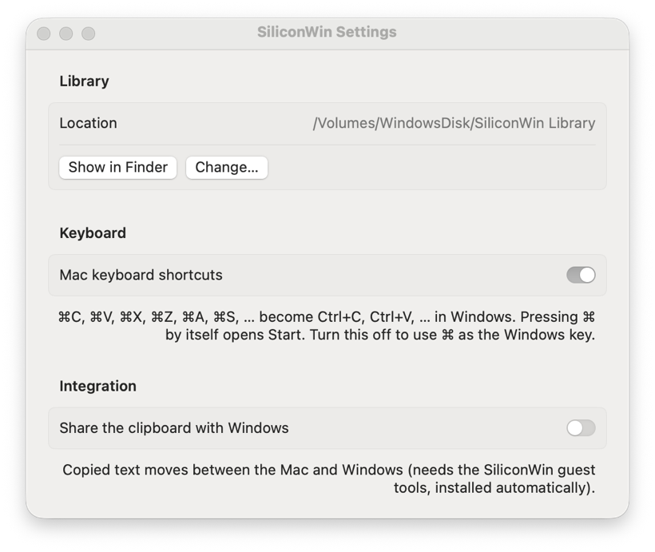

# User guide

This guide walks you through creating a Windows virtual machine with SiliconWin and using it every day.

- [First launch](#first-launch)
- [Creating a virtual machine](#creating-a-virtual-machine)
- [The installation](#the-installation)
- [Using Windows](#using-windows)
- [Keyboard](#keyboard)
- [Clipboard and files](#clipboard-and-files)
- [Display and resolution](#display-and-resolution)
- [Snapshots](#snapshots)
- [Virtual machine settings](#virtual-machine-settings)
- [App settings](#app-settings)
- [Activating Windows](#activating-windows)
- [Managing virtual machines](#managing-virtual-machines)

## First launch

Build the app as described in the [README](../README.md#getting-started), then open `SiliconWin.app`.

SiliconWin keeps all virtual machines and downloaded installers in a **library** folder:

| The app runs from | Default library |
| --- | --- |
| An external drive (`/Volumes/<Drive>/…`) | `/Volumes/<Drive>/SiliconWin Library` |
| Anywhere else | `~/Library/Application Support/SiliconWin` |

You can choose another folder in **SiliconWin › Settings…** (⌘,).

> [!NOTE]
> If the library is on an external drive, macOS asks once whether SiliconWin may access files on a removable volume. Click **Allow**.

## Creating a virtual machine

Click **New Virtual Machine** (⌘N). The wizard has four steps.

### 1. Windows

Choose the edition:

| Edition | Speed | When to use it |
| --- | --- | --- |
| **Windows 11 on Arm** (recommended) | Near-native | Almost always. Most x64 Windows apps run through Windows' built-in emulation. |
| Windows 11 (x64, emulated) | Several times slower | Only for software that refuses to run on Windows on Arm |
| Windows 10 (x64, emulated) | Several times slower | Legacy software. Windows 10 reached end of support in October 2025. |

### 2. Installer

You need a Windows installation ISO.

- **Download from Microsoft…** opens Microsoft's official download page inside SiliconWin.
  1. Choose the edition and your language.
  2. Click the download button for your architecture: **Arm64** for Windows on Arm, **64-bit** for x64.
  3. The ISO, about 5–8 GB, streams into the library's `ISOs` folder. You can follow the progress in the wizard.
- **Choose ISO File…** uses an ISO you already have.

ISOs already in the library are listed for reuse. SiliconWin warns you if the file name doesn't look like it matches the edition you picked.

### 3. Hardware

| Setting | Recommendation |
| --- | --- |
| **Processor cores** | Defaults to your core count minus two, up to 8. Leave some cores for macOS. |
| **Memory** | 8 GB is comfortable for Windows 11, and 4 GB is the minimum. The default is a third of your Mac's memory, capped at 8 GB. |
| **Windows disk** | Choose a size, or turn on **Use all free space on \<drive\>**. The disk is sparse, so it only takes the space Windows actually uses. |
| **Display** | The default fills your screen exactly in full screen. See [Display and resolution](#display-and-resolution). |

### 4. Setup

With **Install Windows automatically** turned on, you answer nothing during installation:

- **User name.** Windows creates a local administrator account with this name.
- **Password.** Optional. If you leave it empty, the account has no password and signs in automatically.
- **Computer name.** The name Windows uses on the network.
- **Region.** Your Mac's time zone and keyboard layouts are copied into Windows automatically.
- **I accept the Microsoft Software License Terms for Windows.** Required for automatic setup, because the answer file accepts the license terms on your behalf.

Turn automatic installation off to go through Windows Setup yourself in the VM window.

Click **Create and Install**.

## The installation

With automatic setup, the installation needs no input:

1. The VM boots from the installer. SiliconWin answers the *"Press any key to boot from CD or DVD"* prompt for you.
2. Windows Setup copies files, installs the VirtIO drivers and restarts a few times.
3. The out-of-box screens are skipped, and Windows signs in to your account.
4. SiliconWin's guest tools finish setting up. The installer disc is then detached automatically.

The whole process takes about **15–30 minutes**. A banner at the top of the screen shows that the installation is in progress. You can keep using your Mac in the meantime. Don't shut the VM down until the Windows desktop appears.

> [!TIP]
> Once Windows is installed, take a [snapshot](#snapshots) named something like "Fresh install". You can always return to it.

## Using Windows

Select a VM in the sidebar. While it's stopped, you see an overview with its hardware, disk usage and snapshots. Click **Start Windows** to start it.

While Windows runs, the toolbar offers these controls:

| Button | What it does |
| --- | --- |
| **Send Files** | Copies files or folders from your Mac to the Windows desktop |
| **Ctrl+Alt+Delete** | Sends Ctrl+Alt+Delete, for example to open Task Manager or lock Windows |
| **Pause / Resume** | Freezes the VM in memory and continues it later |
| **Restart** | Resets the VM, like pressing a reset button. Unsaved work in Windows is lost. |
| **Shut Down** | Asks Windows to shut down cleanly. Hold the button for **Turn Off Immediately**, which is like pulling the plug. |
| **Full Screen** | Enters or leaves full screen (⌃⌘F). In full screen, the toolbar appears when you move the pointer to the top. |

The same commands are in the **Virtual Machine** menu.

- **Mouse.** The pointer moves freely between macOS and Windows. It's never captured, so there is no key combination to release it. Scrolling works with mice and trackpads.
- **Sound.** Windows' audio plays through your Mac's current output device.
- **Network.** Windows shares your Mac's internet connection through NAT. It can reach the internet and your local network, but other devices can't connect to services inside Windows.

When you quit SiliconWin while Windows is running, the app offers to shut Windows down first, or to turn it off immediately.

## Keyboard

SiliconWin sends the *physical* position of each key. The keyboard layout selected **in Windows** decides which character you get. The Mac's input source doesn't matter. To switch layouts in Windows, press Alt+Shift (⌥⇧).

| On the Mac | In Windows |
| --- | --- |
| ⌘ + A B C F I K L N O P R S T U V W X Y Z 0 - = | Ctrl + the same key (copy, paste, save, find, new tab, zoom, …) |
| ⌘ + any other key | Windows key + that key, for example ⌘E for File Explorer or ⌘D for the desktop |
| ⌘ pressed and released alone | Opens Start |
| ⌃ Control, ⌥ Option, ⇧ Shift | Ctrl, Alt, Shift |
| ⌃⌥⌦ (⌃⌥fn⌫ on laptops) | Ctrl+Alt+Delete |
| ⌃⌘F | Full screen (handled by macOS, not sent to Windows) |

To use ⌘ as a plain Windows key, turn off **Mac keyboard shortcuts** in SiliconWin's settings.

Text typed by software, such as text expanders, dictation tools and automation, is typed into Windows character by character.

## Clipboard and files

### Clipboard

When **Share the clipboard with Windows** is on (in SiliconWin's settings), copied text moves between macOS and Windows in both directions. Only plain text is shared.

> [!WARNING]
> With clipboard sharing on, anything you copy on the Mac can be read by software running in Windows. Password managers mark the secrets they copy as concealed, and SiliconWin never sends those. Text you copy yourself, such as recovery phrases or keys, *is* sent. Turn sharing off while you work with sensitive data.

### Sending files to Windows

- **Drag** files or folders onto the Windows screen, or
- click **Send Files** in the toolbar and choose them.

They appear in a **From Mac** folder on the Windows desktop. Folders are compressed and arrive as `.zip` files. Progress shows at the bottom of the screen.

File transfer needs the SiliconWin guest tools, which the automatic installation sets up. It works as soon as you're signed in to Windows.

## Display and resolution

Windows on Arm uses the resolution that SiliconWin's firmware sets when the VM starts. You can't change it from Windows' display settings. Instead:

1. Shut Windows down.
2. Open the VM's **Settings…** and pick a **Display** resolution.
3. Start Windows again.

| Choice | Result |
| --- | --- |
| **Full screen (default)** | Your screen's size in points, for example 1728 × 1084 on a 16-inch MacBook Pro. In full screen, every Windows pixel maps to exactly 2×2 Retina pixels. Sharp and fast, at 100 % scaling. |
| **Retina** | Your screen's native pixel count. Set Windows' scale to **200 %** (Settings › System › Display) for very sharp text. |
| **Presets** | Common sizes from 1280 × 800 up to 3840 × 2160 |

In a window, the picture is scaled to fit while keeping its aspect ratio.

## Snapshots

A snapshot saves the complete state of the VM's storage: the Windows disk, the UEFI settings and the TPM. Snapshots use APFS clones, so they're instant and only use disk space for what changes afterwards.

You find them in the VM overview while the VM is shut down:

- **Take Snapshot…** names and saves the current state.
- **Restore…** returns the VM to a snapshot. Anything changed since then is lost, unless you take another snapshot first.
- The **trash** button deletes a snapshot.

Snapshots require the library to be on an APFS-formatted drive. You can only take and restore snapshots while the VM is shut down, and they don't include the VM's memory.

## Virtual machine settings

Open a stopped VM's **Settings…** to change:

| Setting | Notes |
| --- | --- |
| Name | The VM's name in the sidebar |
| Processor cores and memory | Take effect the next time Windows starts |
| Windows disk | Can only grow. Afterwards, extend the C: partition in Windows' **Disk Management**. |
| Display | See [Display and resolution](#display-and-resolution) |
| Network, sound | Turn the virtual network card or sound card on or off |
| Installation | Shows the installation status. Lets you detach the installer manually, or reinstall Windows from an ISO. |

## App settings

**SiliconWin › Settings…** (⌘,):

| Setting | Meaning |
| --- | --- |
| **Library** | Where VMs and ISOs are stored. **Change…** picks another folder. Existing VMs aren't moved. |
| **Mac keyboard shortcuts** | ⌘ shortcuts become Ctrl shortcuts in Windows. Off: ⌘ is the Windows key. |
| **Share the clipboard with Windows** | Two-way text clipboard sharing. See [Clipboard and files](#clipboard-and-files). |

## Activating Windows

SiliconWin installs **Windows 11 Pro** (or Windows 10 Pro) using Microsoft's generic installation key. That key selects the edition but doesn't activate Windows. Unactivated Windows works, but it shows a watermark, and some personalization settings are locked.

To activate, open **Settings › System › Activation** in Windows, choose **Change product key** and enter your own key.

## Managing virtual machines

- **Show in Finder.** Right-click a VM in the sidebar, or use **Virtual Machine › Show in Finder**. Each VM is a single `.winvm` folder.
- **Delete.** Right-click › **Move to Trash…** moves the VM to the drive's Trash. You can restore it from there until you empty the Trash.
- **Back up.** Shut the VM down, then copy its `.winvm` folder. `disk.img` is a sparse file. On the same APFS drive, `cp -c` clones it instantly. Some tools expand sparse files to their full size when they copy them to another drive.
- **Move.** Move the `.winvm` folder into another library's `Virtual Machines` folder while SiliconWin isn't running.
